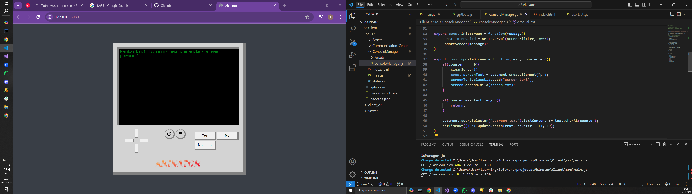

# [Akinator](https://agitagit.github.io/Akinator/Client/Src)

## [Server API](https://github.com/AgitAgit/Akinator/tree/stable/Server#api-documentation)

## Gallery

## Optional future improvements:
-replace the chatgpt paid api with the free google gemini api
-migrate the frontend to react
--add more games to the console

## Stack:

Front-end: HTML - CSS - JavaScript

Back-end: Node.js - MongoDB Atlas

Deployment: Github pages - Render

## Contributors
- [Yossef Sabag](https://github.com/YosefHayim) Server side
- [Amit Kubani](https://github.com/AgitAgit) Client side

